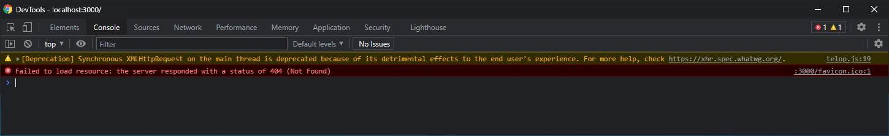

# telop-js
This repo is practice for telop.

### 3485be1


### deprecation

```
[Deprecation] Synchronous XMLHttpRequest on the main thread is deprecated because of its detrimental effects to the end user's experience. For more help, check https://xhr.spec.whatwg.org/.
getJSON @ telop.js:19
```


